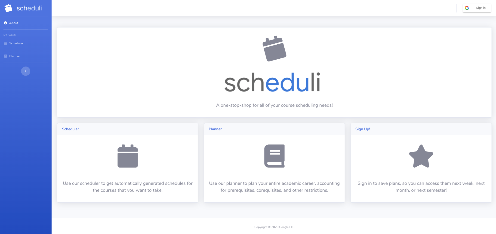
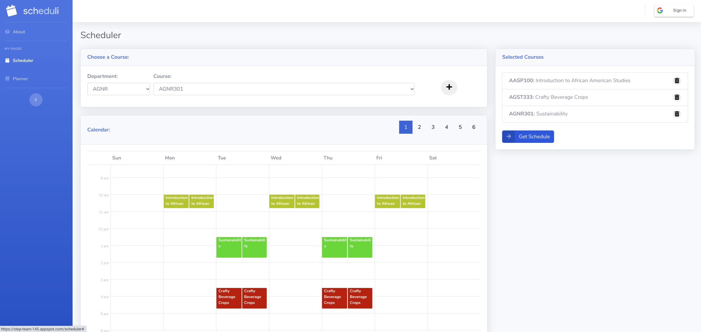
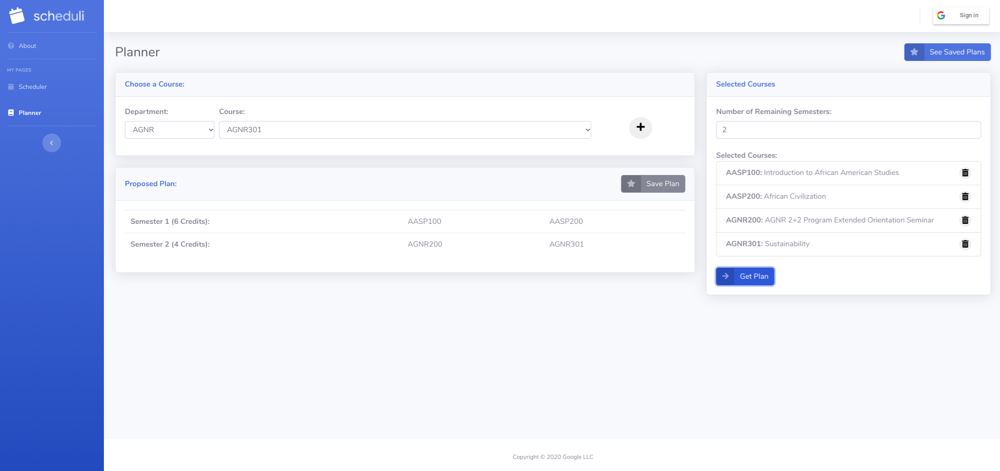

# step145-2020
STEP Capstone repository for Ramya Bhaskara, Naa'Oli Mamie, and Savion Sample. 

* To run a local server, execute this command: 
```
make devserver
```

* To deploy to step-team-145.appspot.com:
```
make deploy
```
# Scheduli
Planning your class schedule can be hard. Universities are known for having outdated websites and interfaces, adding to the frustration of trying to organize the classes you need to take that semester and beyond. 

Scheduli eases this process by providing an intuitive way to plan your academic career. 




### Scheduler
Scheduling next semesters courses is a hassle -- you have to worry about conflicting courses, timings, and other preferences. 
The scheduler feature allows you to input the courses you want to take next semester, and will provide you with various options for a schedule. 
You can navigate through the different schedules, and decide which one best fits your preferences!




### Planner
Planning your academic career can be very difficult, especially when you have to consider prerequisites, corequisites, and your graduation date. 
The planner feature does all of this for you! Just input all the classes you have to take before you graduate, and the number of semesters you have left. 
It then will give you a valid plan that you can use until you graduate. 




You can even save the generated plans, so you can access them next week, next month, or even next semester!
